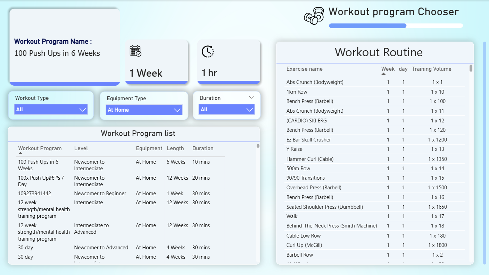
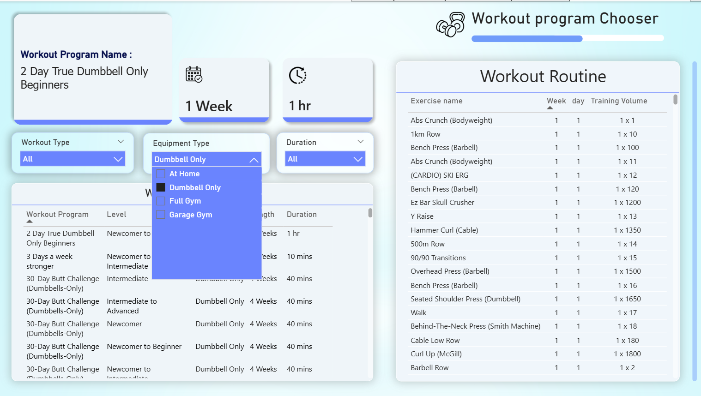

# Fitness Workout Program Analytics Dashboard

[](https://powerbi.microsoft.com/)
[](https://www.postgresql.org/)
[](https://www.kaggle.com/datasets/adnanelouardi/600k-fitness-exercise-and-workout-program-dataset)

## Overview

This repository contains a comprehensive business intelligence solution built with Microsoft Power BI, analyzing the [600K+ Fitness Exercise & Workout Program Dataset](https://www.kaggle.com/datasets/adnanelouardi/600k-fitness-exercise-and-workout-program-dataset) from Kaggle. The project demonstrates advanced data analytics capabilities through interactive dashboards that process and visualize approximately 600,000 fitness-related records.

## Dataset Information

- **Source**: [Kaggle - 600K+ Fitness Exercise & Workout Program Dataset](https://www.kaggle.com/datasets/adnanelouardi/600k-fitness-exercise-and-workout-program-dataset)
- **Size**: ~600,000 records
- **Content**: Workout programs, exercises, difficulty levels, equipment types, session durations

## Tech Stack

| Technology | Purpose |
|------------|---------|
| **PostgreSQL** | Data cleansing, transformation, and database view creation |
| **Power Query** | Dynamic ETL operations and automated data pipeline management |
| **Power BI** | Interactive dashboard development |
| **DAX** | Advanced measure creation and KPI development |

## Features

- **Dynamic Filtering**: Filter workout programs by equipment type, experience level, and session duration
- **Drill-Down Analysis**: Explore individual workout routines with detailed exercise breakdowns
- **Performance Optimization**: Responsive queries handling 600K+ records efficiently
- **Interactive Visualizations**: User-friendly interface for comprehensive data exploration

## Dashboard Screenshots

### Main Dashboard Interface


### Detailed Analytics View


## Installation & Setup

1. **Prerequisites**
   - Microsoft Power BI Desktop
   - PostgreSQL database server
   - Access to the Kaggle dataset

2. **Getting Started**
   ```bash
   git clone https://github.com/yourusername/fitness-workout-dashboard.git
   cd fitness-workout-dashboard
   ```

3. **Data Setup**
   - Download the dataset from the Kaggle link above
   - Set up PostgreSQL database and import the dataset
   - Import data using the provided Power Query scripts
   - Refresh data model in Power BI

## Key Metrics & Insights

- **Total Workout Programs**: 600K+ analyzed
- **Equipment Categories**: Comprehensive filtering across all equipment types
- **Experience Levels**: Beginner to Advanced program segmentation
- **Training Volume Analysis**: Sets, reps, and duration breakdowns

## Technical Achievements

- ✅ Scalable ETL pipeline architecture (PostgreSQL + Power Query)
- ✅ Interactive dashboard handling large-scale datasets
- ✅ Advanced DAX calculations for dynamic insights
- ✅ Performance-optimized PostgreSQL queries for responsive user experience

## Contributing

Contributions are welcome! Please feel free to submit a Pull Request.

## License

This project is licensed under the MIT License - see the [LICENSE](LICENSE) file for details.

## Contact

For questions or collaboration opportunities, please reach out via [GitHub Issues](https://github.com/yourusername/fitness-workout-dashboard/issues).
